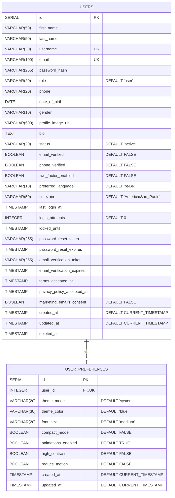

# Diagrama do Banco de Dados

## Diagrama ER (Entity-Relationship)



## Estrutura Detalhada

### Tabela: `users`

#### Campos Principais
- **id** (SERIAL PRIMARY KEY): Identificador único do usuário
- **first_name** (VARCHAR(50) NOT NULL): Primeiro nome
- **last_name** (VARCHAR(50) NOT NULL): Sobrenome
- **username** (VARCHAR(30) UNIQUE NOT NULL): Nome de usuário único
- **email** (VARCHAR(100) UNIQUE NOT NULL): Email único

#### Autenticação e Segurança
- **password_hash** (VARCHAR(255) NOT NULL): Hash da senha (bcrypt)
- **role** (VARCHAR(20)): Papel do usuário (`admin` ou `user`)
- **login_attempts** (INTEGER): Tentativas de login
- **locked_until** (TIMESTAMP): Data/hora de bloqueio da conta
- **two_factor_enabled** (BOOLEAN): Autenticação de dois fatores habilitada

#### Perfil do Usuário
- **phone** (VARCHAR(20)): Telefone
- **date_of_birth** (DATE): Data de nascimento
- **gender** (VARCHAR(10)): Gênero (`male`, `female`, `other`, `prefer_not_to_say`)
- **profile_image_url** (VARCHAR(500)): URL da imagem de perfil
- **bio** (TEXT): Biografia do usuário

#### Status e Verificações
- **status** (VARCHAR(20)): Status da conta (`active`, `inactive`, `suspended`, `deleted`)
- **email_verified** (BOOLEAN): Email verificado
- **phone_verified** (BOOLEAN): Telefone verificado

#### Recuperação de Senha
- **password_reset_token** (VARCHAR(255)): Token de reset de senha
- **password_reset_expires** (TIMESTAMP): Expiração do token de reset

#### Verificação de Email
- **email_verification_token** (VARCHAR(255)): Token de verificação de email
- **email_verification_expires** (TIMESTAMP): Expiração do token de verificação

#### Preferências
- **preferred_language** (VARCHAR(10)): Idioma preferido (padrão: `pt-BR`)
- **timezone** (VARCHAR(50)): Fuso horário (padrão: `America/Sao_Paulo`)
- **marketing_emails_consent** (BOOLEAN): Consentimento para emails de marketing

#### Termos e Políticas
- **terms_accepted_at** (TIMESTAMP): Data de aceitação dos termos
- **privacy_policy_accepted_at** (TIMESTAMP): Data de aceitação da política de privacidade

#### Auditoria
- **created_at** (TIMESTAMP): Data de criação
- **updated_at** (TIMESTAMP): Data da última atualização (atualizado automaticamente via trigger)
- **deleted_at** (TIMESTAMP): Data de exclusão (soft delete)
- **last_login_at** (TIMESTAMP): Data do último login

### Índices

Para otimização de consultas:
- `idx_users_email`: Índice no campo `email`
- `idx_users_username`: Índice no campo `username`
- `idx_users_status`: Índice no campo `status`
- `idx_users_created_at`: Índice no campo `created_at`
- `idx_users_deleted_at`: Índice no campo `deleted_at`

### Constraints (Restrições)

#### CHECK Constraints
- **role**: Deve ser `admin` ou `user`
- **status**: Deve ser `active`, `inactive`, `suspended` ou `deleted`
- **gender**: Deve ser `male`, `female`, `other` ou `prefer_not_to_say`

#### UNIQUE Constraints
- **username**: Único no sistema
- **email**: Único no sistema

### Triggers

- **update_users_updated_at**: Atualiza automaticamente o campo `updated_at` sempre que um registro é modificado

### Funções

- **update_updated_at_column()**: Função PL/pgSQL que atualiza o timestamp de `updated_at`

## Usuário Administrador Padrão

O sistema cria automaticamente um usuário administrador:
- **Email**: admin@sistema.com
- **Username**: admin
- **Senha**: admin123
- **Role**: admin
- **Status**: active

⚠️ **IMPORTANTE**: Altere a senha padrão após o primeiro login!

### Tabela: `user_preferences`

#### Campos Principais
- **id** (SERIAL PRIMARY KEY): Identificador único da preferência
- **user_id** (INTEGER UNIQUE NOT NULL FK): Referência ao usuário (chave estrangeira única)

#### Tema e Aparência
- **theme_mode** (VARCHAR(20)): Modo do tema (`light`, `dark`, `system`)
- **theme_color** (VARCHAR(30)): Cor principal do tema (padrão: `blue`)

#### Interface
- **font_size** (VARCHAR(20)): Tamanho da fonte (`small`, `medium`, `large`, `extra-large`)
- **compact_mode** (BOOLEAN): Modo compacto da interface
- **animations_enabled** (BOOLEAN): Animações habilitadas

#### Acessibilidade
- **high_contrast** (BOOLEAN): Modo de alto contraste
- **reduce_motion** (BOOLEAN): Reduzir animações (acessibilidade)

#### Auditoria
- **created_at** (TIMESTAMP): Data de criação
- **updated_at** (TIMESTAMP): Data da última atualização (atualizado automaticamente via trigger)

### Relacionamentos

- **USERS → USER_PREFERENCES**: Relação 1:1 (um usuário possui uma configuração de preferências)
- **Foreign Key**: `user_preferences.user_id` referencia `users.id`
- **ON DELETE CASCADE**: Quando um usuário é deletado, suas preferências são automaticamente removidas

### Índices de user_preferences

Para otimização de consultas:
- `idx_user_preferences_user_id`: Índice no campo `user_id`
- `idx_user_preferences_theme_mode`: Índice no campo `theme_mode`

### Constraints (Restrições) de user_preferences

#### CHECK Constraints
- **theme_mode**: Deve ser `light`, `dark` ou `system`
- **font_size**: Deve ser `small`, `medium`, `large` ou `extra-large`

#### UNIQUE Constraints
- **user_id**: Cada usuário pode ter apenas um registro de preferências

### Triggers de user_preferences

- **update_user_preferences_updated_at**: Atualiza automaticamente o campo `updated_at` sempre que um registro é modificado

## Visualização Simplificada

```
┌─────────────────────────────────────────────────┐
│                     USERS                       │
├─────────────────────────────────────────────────┤
│ PK │ id                                         │
│ UK │ username                                   │
│ UK │ email                                      │
│    │ password_hash                              │
│    │ first_name, last_name                      │
│    │ role (admin/user)                          │
│    │ status (active/inactive/suspended/deleted) │
│    │ phone, date_of_birth, gender               │
│    │ profile_image_url, bio                     │
│    │ email_verified, phone_verified             │
│    │ two_factor_enabled                         │
│    │ preferred_language, timezone               │
│    │ last_login_at, login_attempts              │
│    │ locked_until                               │
│    │ password_reset_token                       │
│    │ password_reset_expires                     │
│    │ email_verification_token                   │
│    │ email_verification_expires                 │
│    │ terms_accepted_at                          │
│    │ privacy_policy_accepted_at                 │
│    │ marketing_emails_consent                   │
│    │ created_at, updated_at, deleted_at         │
└─────────────────────────────────────────────────┘
                         │
                         │ 1:1
                         │
┌─────────────────────────────────────────────────┐
│              USER_PREFERENCES                   │
├─────────────────────────────────────────────────┤
│ PK │ id                                         │
│ FK │ user_id (UNIQUE) → users.id                │
│ UK │                                            │
│    │ theme_mode (light/dark/system)             │
│    │ theme_color (blue)                         │
│    │ font_size (small/medium/large/extra-large) │
│    │ compact_mode                               │
│    │ animations_enabled                         │
│    │ high_contrast                              │
│    │ reduce_motion                              │
│    │ created_at, updated_at                     │
└─────────────────────────────────────────────────┘

Índices USERS: email, username, status, created_at, deleted_at
Índices USER_PREFERENCES: user_id, theme_mode
```

## Observações

1. **Soft Delete**: O sistema usa `deleted_at` para exclusão lógica (soft delete)
2. **Timestamps Automáticos**: `updated_at` é atualizado automaticamente via trigger (tanto em users quanto em user_preferences)
3. **Segurança**: Senhas são armazenadas como hash (bcrypt)
4. **Tentativas de Login**: Sistema de bloqueio após múltiplas tentativas
5. **Tokens**: Sistema de recuperação de senha e verificação de email via tokens
6. **GDPR Compliance**: Campos para consentimento de marketing e políticas de privacidade
7. **Preferências Automáticas**: Ao criar um usuário (registro ou criação admin), suas preferências são automaticamente criadas com valores padrão
8. **Cascade Delete**: Quando um usuário é deletado, suas preferências são automaticamente removidas devido ao `ON DELETE CASCADE`
9. **Relação 1:1**: Cada usuário tem exatamente um registro de preferências (garantido pelo UNIQUE constraint em user_id)
